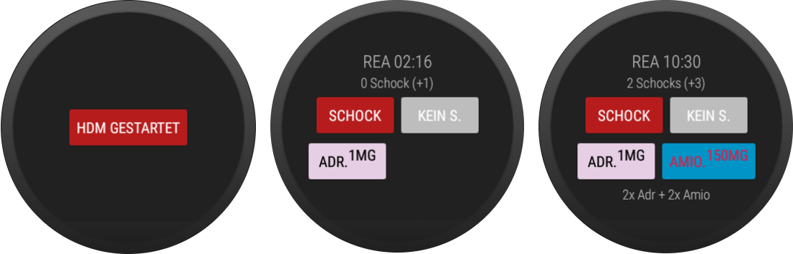

# Watch ALS

Quickly log your actions while doing Advanced Life Support (ALS) on CPR with a fingertip -- all data is stored locally on your watch.

## Download

Head to releases on the right side and install the .apk.

## Development

Help is greatly appreciated! Fork this project and issue a merge request!

- [ ] Arzneimittelliste RKNÖ
- [ ] Logging events

## Screenhots

